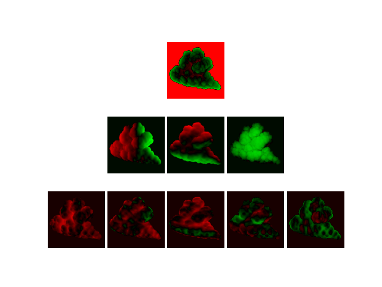
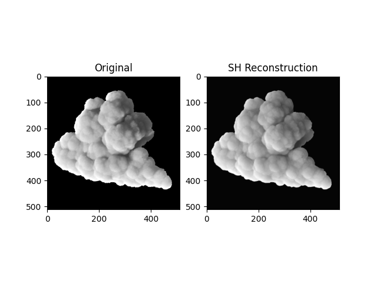
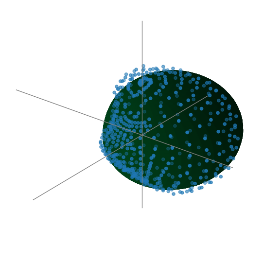
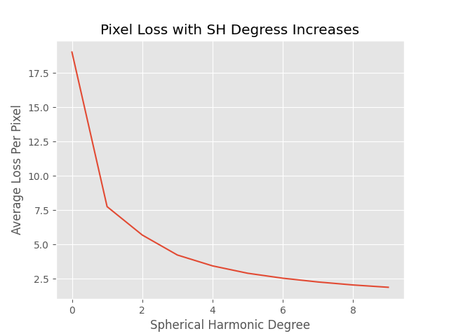
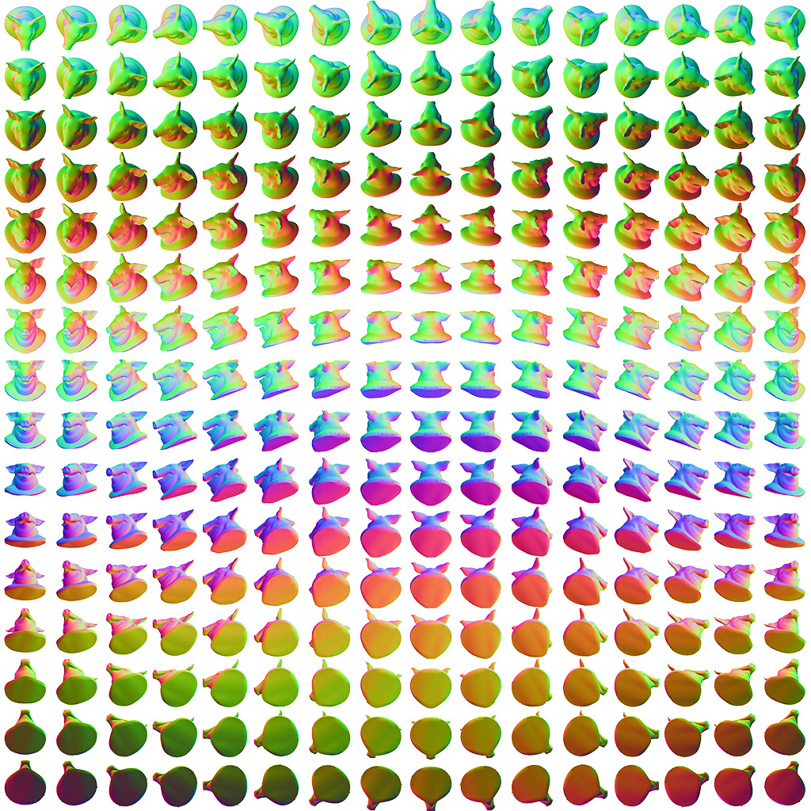
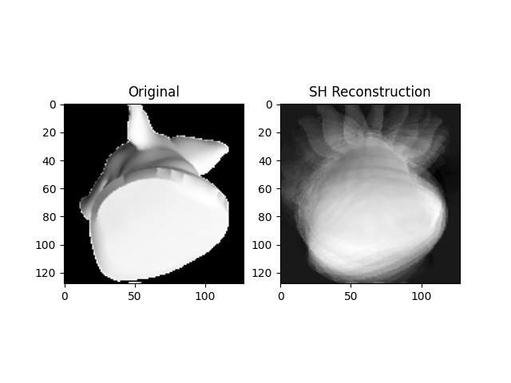
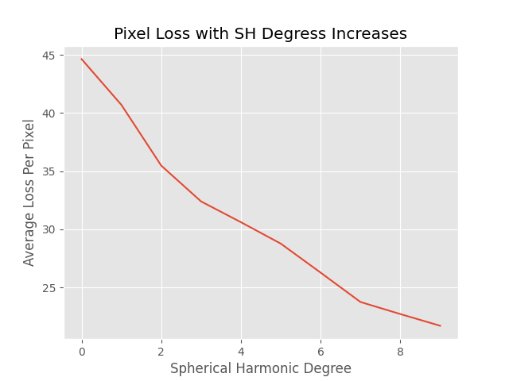
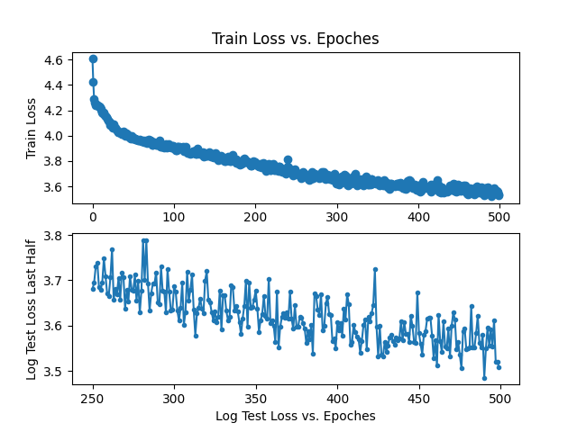

# Several Lightfield Imposter Research

## 1 SH Lit Imposter  

Inspired by [6-way lightmap](https://realtimevfx.com/t/smoke-lighting-and-texture-re-usability-in-skull-bones), this is a better approach in quality.  
Basic idea is to encode per-pixel spherical harmonic coefficents of a imposter in texture.  

Compare with 6-way lightmap on right, sh lit imposter is on left.  
  

Ramp color + flowmap implemented in unity (not included in this project)  
 


### 1. Render GroundTruth
open `cloud_sh_imposter.hip` and render `mantra_sh` node, it will render 540 images under `/render` folder.

### 2. Reconstruct SH
```shell
python sh_lit_imposter_generate --lmax <max-degree-of-sh> --recollect True --reconstruct True
```
It will print remap range of each degree sh such as  
```
Normalize Bound is [[0.0, 849.3096980357466], [-219.28922181878514, 200.479331555482], [-96.79751392697558, 116.97197693521237]]
```
And It will generate all degrees and bands of sh coefficients stored in texture, visualize coeffs and reconstruction result.  





### 3. Plot SH reconstructed at given pixel  
run
```shell
python sh_lit_imposter_plot.py --pixx <pixel-id-x> -- pixy <pixel-id-y>
```


### 4. Plot reconstruct loss with SH level increase  
run
```shell
python sh_lit_imposter_loss.py --maxlevel 10
```



## 2 SH 3D Imposter  

Here I want to test compress a 3d imposter texture with SH, result is not good.  



### 1. Render GroundTruth  
Render any geometry with SideFx Labs' Labs Imposter Texture, on "Full 3D Imposter" mode.  

### 2. Reconstruct SH
```shell
python sh_3dimposter_generate.py
```
It will reconstruction result.  



You can see the result is poor, as 3d imposter more high-freq at each pixel.  

## 3. Plot reconstruct loss with SH level increase  
run
```shell
python sh_3dimposter_loss.py --maxlevel 10
```


## 3 NN 3D Imposter

Here I want to test compress a 3d imposter texture with neural network (fully connected network).  


### 1. Render GroundTruth
Same as SH 3D Imposter

### 2. Train Neural Network
```shell
python nn_imposter_train.py
```
It will train the network and plot training loss.  



## 3. Plot result  
run
```shell
python nn_imposter_plot.py
```


# Refs.  
Read more about explanation of this experiment on my blog.  