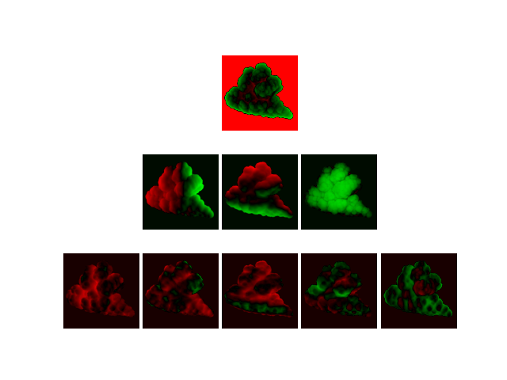
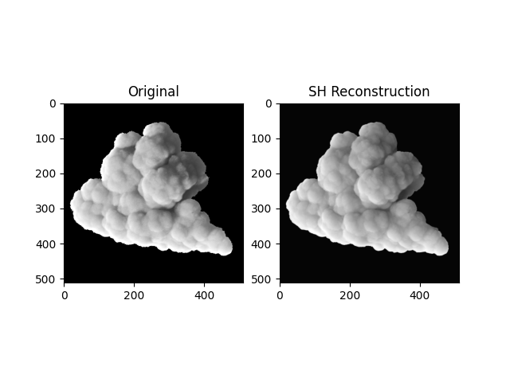
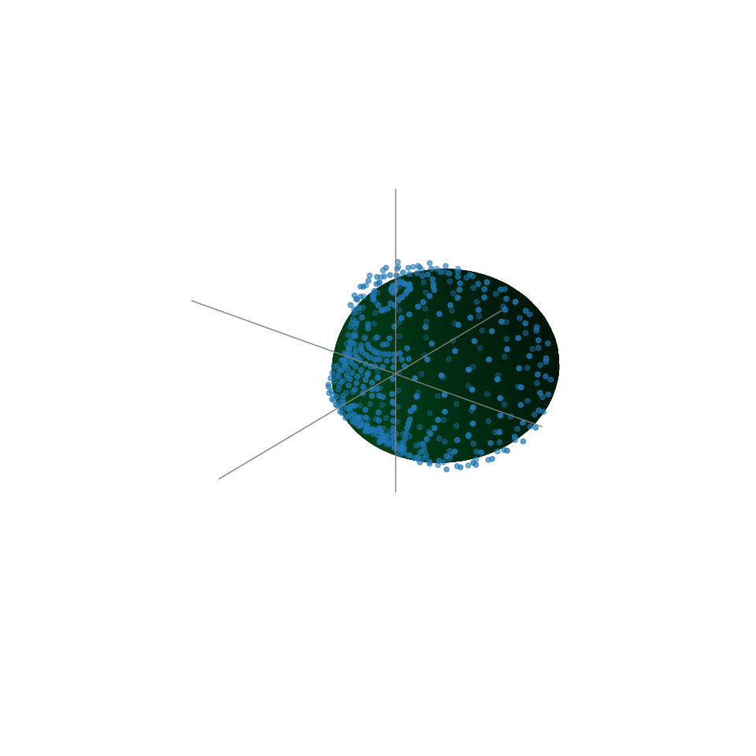
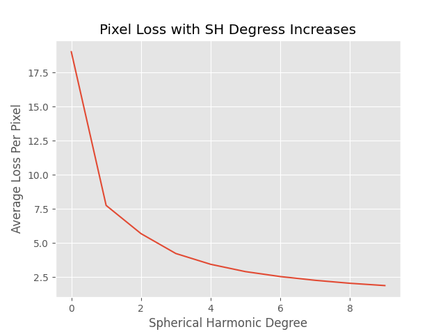
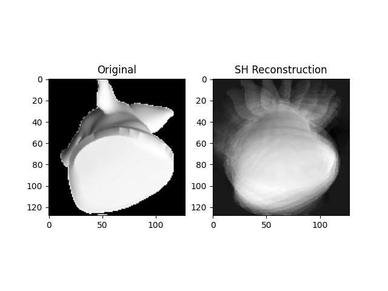
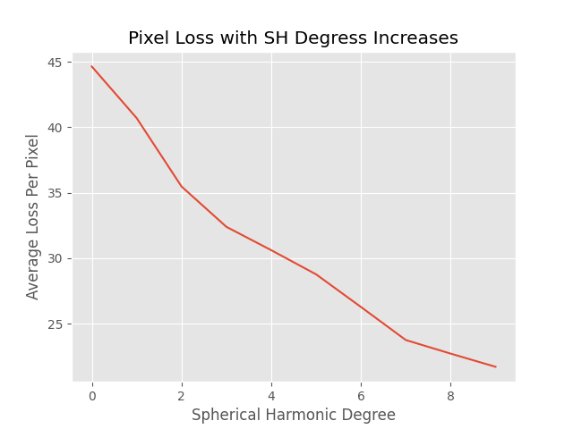
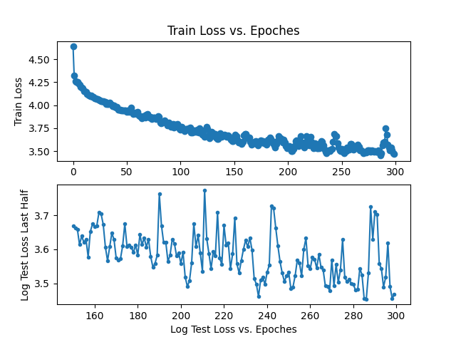

# Several Lightfield Imposter Research

## SH Lit Imposter  

### 1. Render GroundTruth
open `cloud_sh_imposter.hip` and render `mantra_sh` node, it will render 540 images under `/render` folder.

### 2. Reconstruct SH
```shell
python sh_lit_imposter_generate --lmax <max-degree-of-sh> --recollect True --reconstruct True
```
It will print remap range of each degree sh such as  
```
Normalize Bound is [[0.0, 849.3096980357466], [-219.28922181878514, 200.479331555482], [-96.79751392697558, 116.97197693521237]]
```
And It will generate all degrees and bands of sh coefficients stored in texture, visualize coeffs and reconstruction result.  





## 3. Plot SH reconstructed at given pixel  
run
```shell
python sh_lit_imposter_plot.py --pixx <pixel-id-x> -- pixy <pixel-id-y>
```


## 4. Plot reconstruct loss with SH level increase  
run
```shell
python sh_lit_imposter_loss.py --maxlevel 10
```


## SH 3D Imposter

### 1. Render GroundTruth

### 2. Reconstruct SH
```shell
python sh_3dimposter_gemerate.py
```
It will print remap range of each degree sh such as  
```
Normalize Bound is [[0.0, 849.3096980357466], [-219.28922181878514, 200.479331555482], [-96.79751392697558, 116.97197693521237]]
```
And It will generate all degrees and bands of sh coefficients stored in texture, visualize coeffs and reconstruction result.  



You can see the result is poor, as 3d imposter more high-freq at each pixel.  

## 3. Plot reconstruct loss with SH level increase  
run
```shell
python sh_3dimposter_loss.py --maxlevel 10
```


## NN 3D Imposter

### 1. Render GroundTruth
Same as SH 3D Imposter

### 2. Train Neural Network
```shell
python nn_imposter_train.py
```
It will train the network and plot training loss.  



## 3. Plot result  
run
```shell
python nn_imposter_plot.py
```
